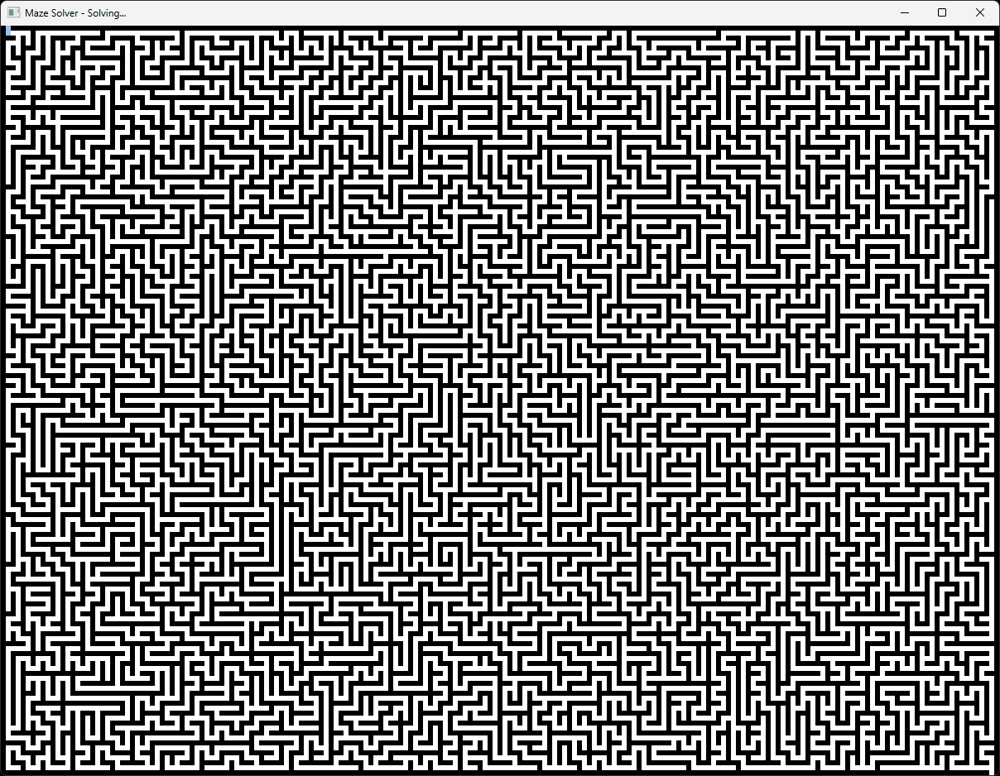
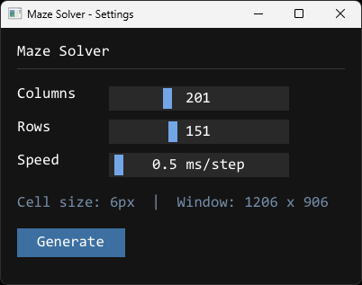

# Maze Solver Visualization

A C++ application that generates and solves mazes with a real-time animated visualization, built with SFML and Dear ImGui.

## How it works

Mazes are generated using **Recursive Backtracking** (DFS) and solved using **Breadth-First Search (BFS)**, which guarantees the shortest path. The visualization animates the solver step by step - blue cells show the BFS exploration, red cells trace the final path.

## Settings

Configure the maze before generating:
- **Columns / Rows** - maze dimensions (odd values only, range 21-601 / 21-401)
- **Speed** - animation speed in ms per step (0.1 - 20.0)

## Controls

| Input | Action |
|---|---|
| Mouse | Drag sliders |
| Arrow keys Up/Down | Switch between sliders |
| Arrow keys Left/Right | Adjust focused slider |
| Enter | Generate maze |
| R | Regenerate with same settings |
| Esc | Return to settings |

## Features

- Maze generation with Recursive Backtracking (DFS)
- Maze solving with Breadth-First Search (BFS) - guaranteed shortest path
- Real-time animation with frame-rate-independent stepping
- Static + dynamic render layer separation for smooth performance
- Resolution-aware UI scaling

## Documentation

Full API documentation: [ilkkahirvela.github.io/MazeSolver-SFML](https://ilkkahirvela.github.io/MazeSolver-SFML/)

## Download

See [Releases](https://github.com/ilkkahirvela/MazeSolver-SFML/releases) for a pre-built Windows executable.

## Built with

- C++17
- [SFML 3.0](https://www.sfml-dev.org/)
- [Dear ImGui](https://github.com/ocornut/imgui) + [ImGui-SFML](https://github.com/SFML/imgui-sfml)

## License

MIT - see [LICENSE](LICENSE) for details.
